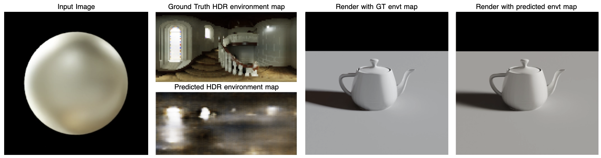

# Material-Guided Decoders: Joint Estimation of Material Properties and HDRI Lighting

Illumination estimation is a key component of achieving realism in inverse rendering, an extensively researched topic in the fields of computer graphics and computer vision. Predicting the material properties of objects with the guidance of light estimation metrics to achieve convincing relighting has also been thoroughly investigated, clearly demonstrating the intrinsic link between light and material information. However, there has been relatively few analyses of whether awareness of material semantic information may directly inform lighting prediction to increase visual realism in scenarios such as virtual object insertion. 
This project investigates this question by predicting HDR panoramic environment maps from single synthetic images with two models. The baseline model uses an encoder and CNN decoder to predict the HDR environment map, while the multi-task model uses the same encoder but with a material-parameter regression head with material information fed back into the decoder. The multi-task model was investigated with two architecture variants to verify the robustness and influence of the material semantic information. A hierarchical evaluation method was employed to determine the correspondence of high material prediction accuracy with realistic lighting prediction. 
he results show that while the baseline model generates HDR maps with high pixel-wise accuracy, the multi-task lighting estimation created far more visually convincing lighting recreations. This project thus demonstrates a clear case that semantic material knowledge acts as a powerful physical constraint in improving realism in illumination estimation, and the limits of applying typical pixel-wise evaluation metrics to use cases that highly value visual realism.  

This section offers a high-level overview of the experimental design, architectural comparisons, and hypothesis guiding this project.

### **Data Preparation and Scene Isolation**

To directly evaluate the connection between material properties and environmental lighting, this project utilizes synthetic images of isolated objects. By controlling the experiment to focus on a single object, the network is forced to prioritize the relationship between surface appearance and the environment lighting. This simplified setup allows for more precise analysis of material-lighting entanglement, but I believe the learned priors will also be generalizable to more complex, multi-object scenes through future semantic segmentation.

### **Architecture Comparison**

To measure the impact of material guidance I created two distinct models.

- Baseline Model: A standard ResNet-based encoder-decoder architecture that performs a direct regression from the input image to the HDR environment map without any explicit material context.
- Multitask Model: This model shares the same ResNet encoder but introduces a secondary material parameter regression head. These estimated material properties, including physical attributes like roughness and metallicity, are fed back into the lighting decoder, allowing the reconstruction process to be conditioned on the semantic identity of the object.

###**Evaluation and Hypothesis**

These models were then evaluated through comparison of their ability to predict accurate environment maps against ground truth data. However, as pixel-wise metrics often fail to capture the nuances of realistic illumination, I also emphasize the evaluation of qualitative downstream rendering. Only by re-rendering complex objects using the predicted environment maps as light probes, can we visually verify the physical plausibility of the lighting.

The central hypothesis of this work is that the multitask model will significantly outperform the baseline, particularly when observing glossy and metallic materials (defined by roughness < 0.2 and metallicity > 0.8). In these instances, the material awareness allows the network to treat shiny surfaces as specular anchors, effectively using the distorted reflections on the object's surface as a high-frequency roadmap to reconstruct the surrounding environment map with greater detail and accuracy.

### Conclusion and Future Work

This project has demonstrated that multi-task light prediction, conditioned on material awareness, is a viable and lightweight solution for inverse rendering. By treating material properties as a physical prior, realistic light probes that excel in downstream rendering tasks may be achieved. 

Future work may look like generalizing to real scenes. This model may be applied to real-world data using multi-object segmentation to handle more complex geometries.

Another direction would be to integrate spherical mover’s loss to improve spatial misalignment issues that were observed when carrying out hdri-map-wise evaluation metrics.

To address the lack of hue consistency, a pipeline that splits the lighting estimation into separate luminance and chromaticity components may be implemented. This would predict a single-channel intensity map as well as a normalized color-map, thus preventing intensity gradients from overpowering color information during backpropagation.

Inspired by recent industry trends, another line to investigate is to split the pipeline into separate specular and diffuse estimation components to better refine how the model reacts to surface reflections.
